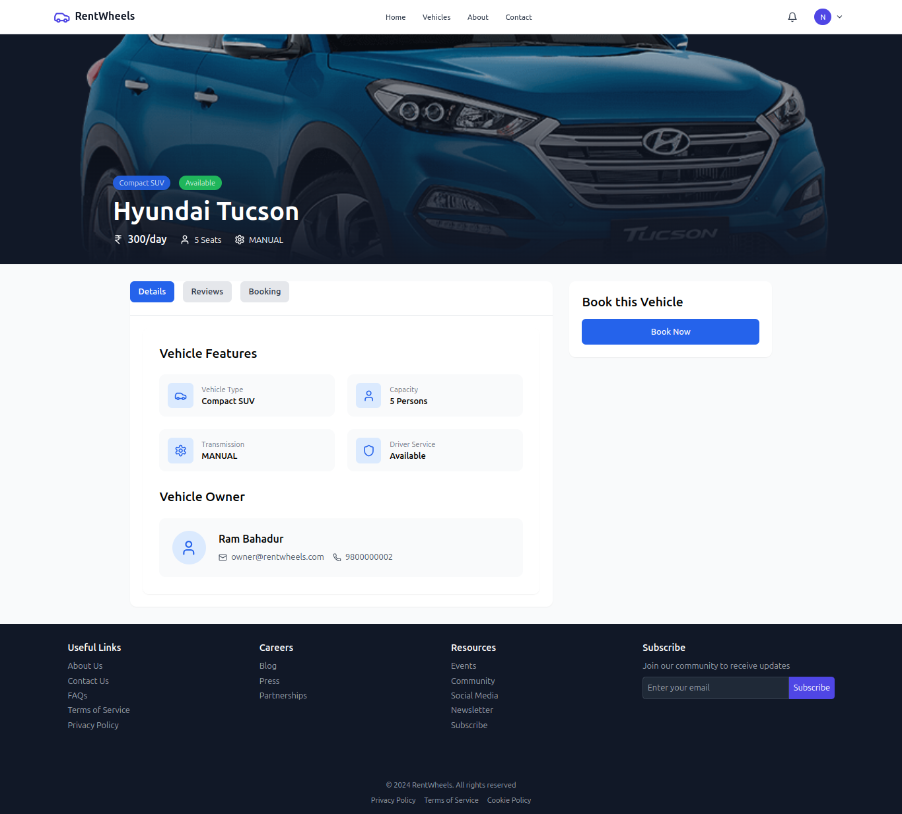
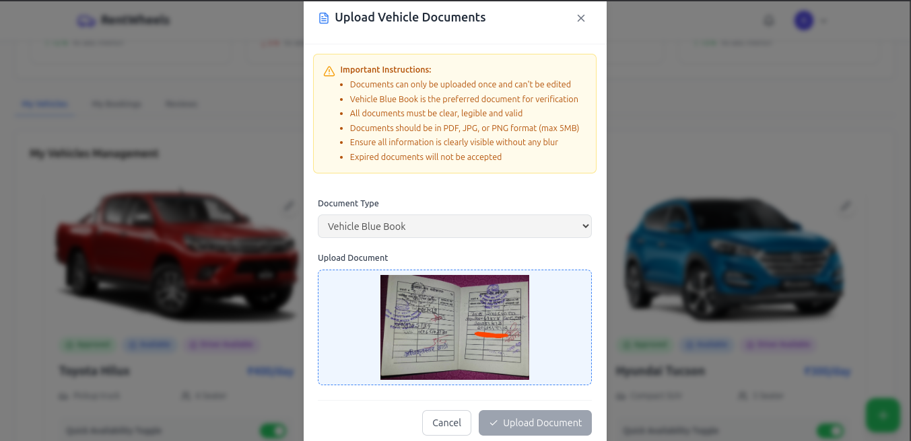

## Scroll down to see the screenshots of the web app

# RentWheels

RentWheels is a multivendor vehicle renting platform where users can rent vehicles, and owners can list their vehicles for rent. The platform features user registration and authentication, booking system, payment gateway integration using Khalti e-wallet, reviews and ratings, and an admin panel for managing the platform.

## Features

- **User Registration and Authentication**
- **Vehicle Listing and Management**
- **Time Blocking for Vehicle Availability**
- **Booking System**
- **Payment Gateway Integration (Khalti e-wallet)**
- **Reviews and Ratings**
- **User Dashboard**
- **Owner Dashboard**
- **Admin Panel**
- **Document Verification for Drivers**

## Tech Stack

- **Frontend**: React
- **Backend**: Node.js, Express
- **Database**: MySQL, Prisma ORM

## Roles

- **User**: Rents vehicles
- **Owner**: Lists vehicles for rent
- **Superadmin**: Verifies owners and manages the platform

## How to Run Locally

To run the project locally, follow these steps:

1. Clone the repository:
    ```sh
    git clone https://github.com/nischaljs/RentWheels.git
    ```

2. Navigate to the project directory:
    ```sh
    cd RentWheels
    ```

3. Install dependencies for the backend:
    ```sh
    cd server
    npm install
    ```

4. Install dependencies for the frontend:
    ```sh
    cd ../client
    npm install
    ```

5. Set up environment variables:
    - Create a `.env` file in the `server` directory and add the necessary environment variables. See `.env.example` for reference.
    - Create a `.env` file in the `client` directory and add the necessary environment variables. See `.env.example` for reference.

6. Migrate the database schema:
    ```sh
    cd ../server
    npx prisma migrate dev
    ```

7. Run the backend server:
    ```sh
    npm start
    ```

8. Run the frontend development server:
    ```sh
    cd ../client
    npm run dev
    ```

9. Open your browser and navigate to `http://localhost:3000` to see the application running.

## Screenshots
 Homepage:
 

 Vehicle Search Page:
 

 Login/ Signup Page:              
     

 User/Customer Dashboard:
 

 Vehicle Profile Page:
     

 
 
 
 

User Payment History Page :


Owners Dashboard:


    


Admin Dashboard


